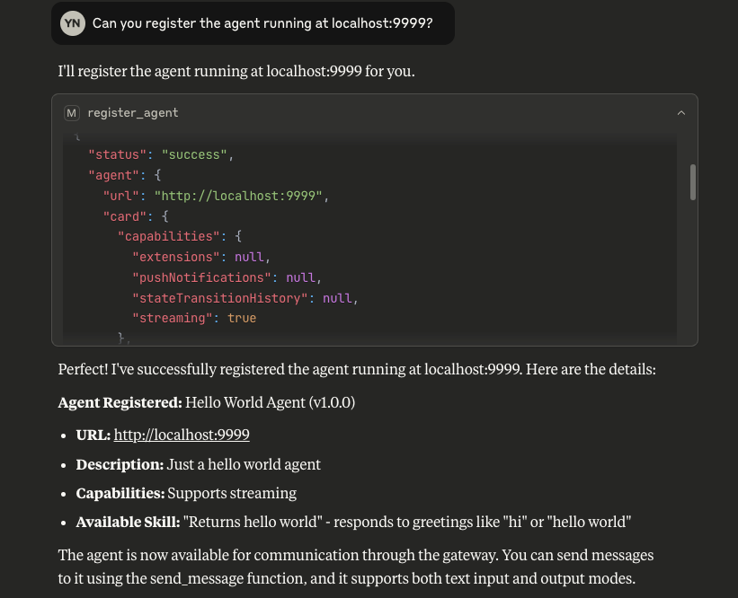
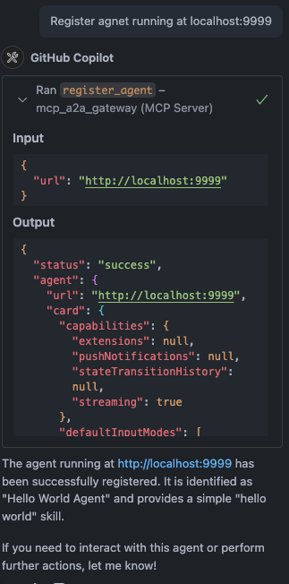
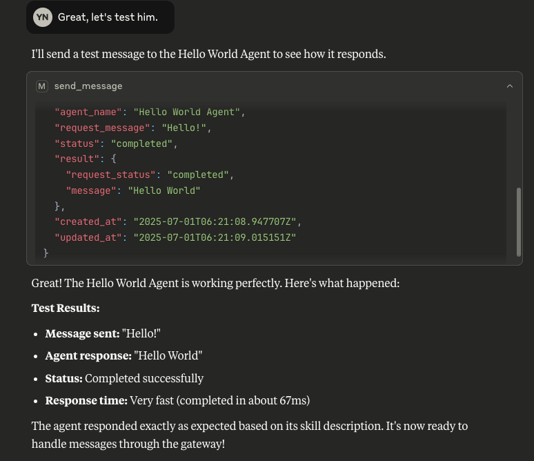
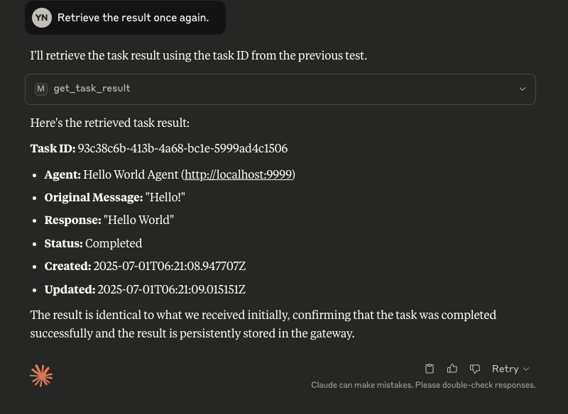

# MCP-A2A-Gateway

[](https://opensource.org/licenses/Apache-2.0)


A gateway server that bridges the Model Context Protocol (MCP) with the Agent-to-Agent (A2A) protocol, enabling MCP-compatible AI assistants (like Claude) to seamlessly interact with A2A agents.

## Overview

This project serves as an integration layer between two cutting-edge AI agent protocols:

- **Model Context Protocol (MCP)**: Developed by Anthropic, MCP allows AI assistants to connect to external tools and data sources. It standardizes how AI applications and large language models connect to external resources in a secure, composable way.

- **Agent-to-Agent Protocol (A2A)**: Developed by Google, A2A enables communication and interoperability between different AI agents through a standardized JSON-RPC interface.

By bridging these protocols, this server allows MCP clients (like Claude) to discover, register, communicate with, and manage tasks on A2A agents through a unified interface.

### Demo

#### 1, Run The hello world Agent in A2A Sample


`also support cloud deployed Agent`


#### 2, Use Claude or github copilot to register the agent.




#### 3, Use Claude to Send a task to the hello Agent and get the result.



#### 4, Use Claude to retrieve the task result.



## Features

- **Agent Management**
  - Register A2A agents with the bridge server
  - List all registered agents
  - Unregister agents when no longer needed

- **Communication**
  - Send messages to A2A agents and receive responses
  - Asynchronous message sending for immediate server response.
  - Stream responses from A2A agents in real-time

- **Task Management**
  - Track which A2A agent handles which task
  - Retrieve task results using task IDs
  - Get a list of all tasks and their statuses.
  - Cancel running tasks

- **Transport Support**
  - Multiple transport types: stdio, streamable-http, SSE
  - Configure transport type using MCP_TRANSPORT environment variable

## Prerequisites

Before you begin, ensure you have the following installed:

- Python 3.11+
- [uv](https://github.com/astral-sh/uv) (for local development)

## Installation

### Option 1: Local Installation

1. Clone the repository:

```bash
git clone https://github.com/yw0nam/MCP-A2A-Gateway.git
cd MCP-A2A-Gateway
```

2. Run using uv. (Note, you need uv for this.)

```bash
uv run mcp-a2a-gateway
```

## Configuration

### Environment Variables

Modify`.env.example` file in the root of the project to `'.env'`

### Transport Types

The A2A MCP Server supports multiple transport types:

1. **stdio** (default): Uses standard input/output for communication
   - Ideal for command-line usage and testing
   - No HTTP server is started
   - Required for Claude Desktop

2. **streamable-http** (recommended for web clients): HTTP transport with streaming support
   - Recommended for production deployments
   - Starts an HTTP server to handle MCP requests
   - Enables streaming of large responses

3. **sse**: Server-Sent Events transport
   - Provides real-time event streaming
   - Useful for real-time updates


## TO connect github copilot

Add below setting.json for sse or http
```
"mcp_a2a_gateway": {
    "url": "http://0.0.0.0:10000/mcp"
}
```

For stdio:

```
"mcp_a2a_gateway": {
    "type": "stdio",
    "command": "uv",
    "args": [
        "--directory",
        "$INSTALLED_DIR",
        "run",
        "mcp-a2a-gateway"
    ]
}
```

## To Connect claude desktop

Add this to cluade_config.json

```
"mcp_a2a_gateway":  {
  "command": "uv",
  "args": ["--directory", "%INSTALLED_DIR", "run", "mcp-a2a-gateway"],
  "env": {
    "MCP_TRANSPORT": "stdio"
  }
}
```


## Available MCP Tools

The server exposes the following MCP tools for integration with LLMs like Claude:

### Agent Management

-   **register_agent**: Register an A2A agent with the bridge server

    ```json
    {
      "name": "register_agent",
      "arguments": {
        "url": "http://localhost:41242"
      }
    }
    ```

-   **list_agents**: Get a list of all registered agents

    ```json
    {
      "name": "list_agents",
      "arguments": {"dummy": "" }
    }
    ```

-   **unregister_agent**: Remove an A2A agent from the bridge server

    ```json
    {
      "name": "unregister_agent",
      "arguments": {
        "url": "http://localhost:41242"
      }
    }
    ```

### Message Processing

-   **send_message**: Send a message to an agent and get a task_id for the response

    ```json
    {
      "name": "send_message",
      "arguments": {
        "agent_url": "http://localhost:41242",
        "message": "What's the exchange rate from USD to EUR?",
        "session_id": "optional-session-id"
      }
    }
    ```

### Task Management

-   **get_task_result**: Retrieve a task's result using its ID

    ```json
    {
      "name": "get_task_result",
      "arguments": {
        "task_id": "b30f3297-e7ab-4dd9-8ff1-877bd7cfb6b1",
      }
    }
    ```

-   **get_task_list**: Get a list of all tasks and their statuses.

    ```json
    {
        "name": "get_task_list",
        "arguments": {}
    }
    ```


## Roadmap & How to Contribute

We are actively developing and improving the gateway! We welcome contributions of all kinds. Here is our current development roadmap, focusing on creating a rock-solid foundation first.

### Core Stability & Developer Experience (Help Wanted! 👍)

This is our current focus. Our goal is to make the gateway as stable and easy to use as possible.

-   [ ] **Implement Streaming Responses**: Full support for streaming responses from A2A agents.
-   [ ] **Enhance Error Handling**: Provide clearer error messages and proper HTTP status codes for all scenarios.
-   [ ] **Input Validation**: Sanitize and validate agent URLs during registration for better security.
-   [ ] **Add Health Check Endpoint**: A simple `/health` endpoint to monitor the server's status.
-   [ ] **Configuration Validation**: Check for necessary environment variables at startup.
-   [ ] **Comprehensive Integration Tests**: Increase test coverage to ensure reliability.
-   [ ] **Cancel Task**: Implement task cancellation
-   [ ] **Implement Streaming Update**: Implement streaming task update. So that user check the progress.


### Community & Distribution


-   [O] **Easy Installation**: Add support for `npx`
-   [ ] **Docker Support**: Provide a Docker Compose setup for easy deployment.
-   [ ] **Better Documentation**: Create a dedicated documentation site or expand the Wiki.

---
**Want to contribute?** Check out the issues tab or feel free to open a new one to discuss your ideas!

## License

This project is licensed under the Apache License, Version 2.0 - see the [LICENSE](LICENSE) file for details.

## Acknowledgments

- Anthropic for the [Model Context Protocol](https://modelcontextprotocol.io/)
- Google for the [Agent-to-Agent Protocol](https://github.com/google/A2A)
- Contributors to the FastMCP library
- Contributors of [A2A-MCP-Server](https://github.com/GongRzhe/A2A-MCP-Server) (This project highly inspired from this repo.)
