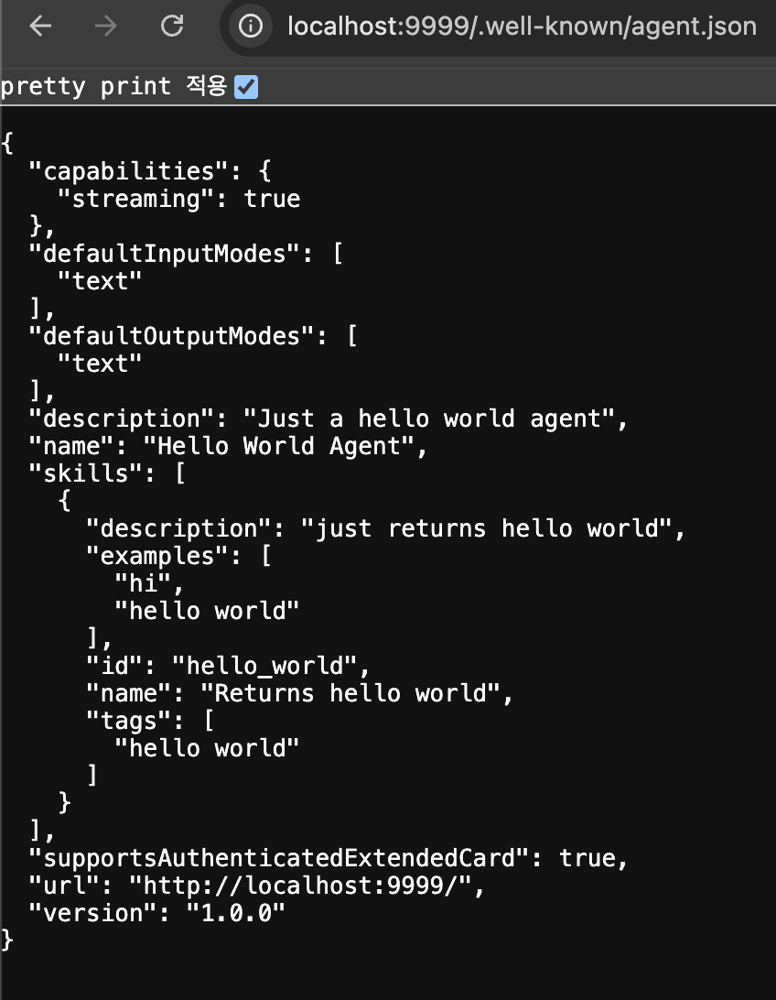
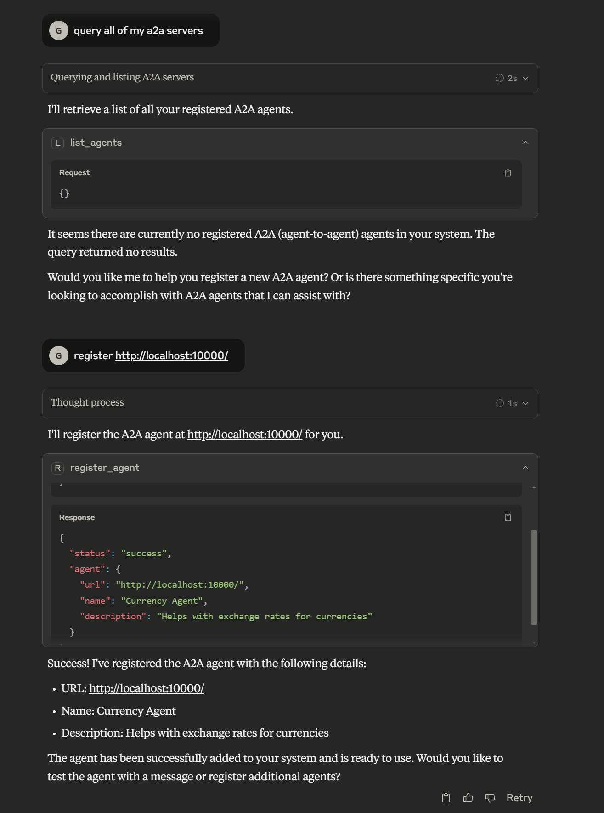
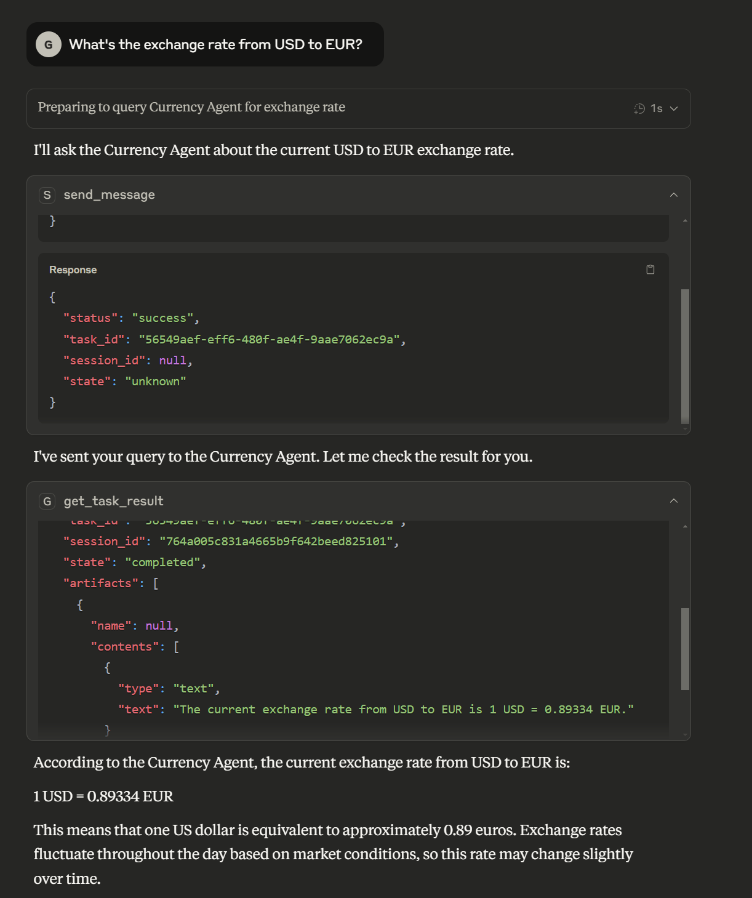

# A2A MCP Server

[](https://opensource.org/licenses/Apache-2.0)

[](https://smithery.ai/server/@GongRzhe/A2A-MCP-Server)

A mcp server that bridges the Model Context Protocol (MCP) with the Agent-to-Agent (A2A) protocol, enabling MCP-compatible AI assistants (like Claude) to seamlessly interact with A2A agents.

## Overview

This project serves as an integration layer between two cutting-edge AI agent protocols:

- **Model Context Protocol (MCP)**: Developed by Anthropic, MCP allows AI assistants to connect to external tools and data sources. It standardizes how AI applications and large language models connect to external resources in a secure, composable way.

- **Agent-to-Agent Protocol (A2A)**: Developed by Google, A2A enables communication and interoperability between different AI agents through a standardized JSON-RPC interface.

By bridging these protocols, this server allows MCP clients (like Claude) to discover, register, communicate with, and manage tasks on A2A agents through a unified interface.

### Demo

#### 1, Run The Currency Agent in A2A Sample



`also support cloud deployed Agent`


#### 2, Use Claude to Register the Currency Agent 



#### 3, Use Claude to Send a task to the Currency Agent and get the result 



## Features

- **Agent Management**
  - Register A2A agents with the bridge server
  - List all registered agents
  - Unregister agents when no longer needed

- **Communication**
  - Send messages to A2A agents and receive responses
  - Stream responses from A2A agents in real-time

- **Task Management**
  - Track which A2A agent handles which task
  - Retrieve task results using task IDs
  - Cancel running tasks

- **Transport Support**
  - Multiple transport types: stdio, streamable-http, SSE
  - Configure transport type using MCP_TRANSPORT environment variable

## Installation

### Installing via Smithery

To install A2A Bridge Server for Claude Desktop automatically via [Smithery](https://smithery.ai/server/@GongRzhe/A2A-MCP-Server):

```bash
npx -y @smithery/cli install @GongRzhe/A2A-MCP-Server --client claude
```

### Option 1: Install from PyPI

```bash
pip install a2a-mcp-server
```

### Option 2: Local Installation

1. Clone the repository:
   ```bash
   git clone https://github.com/GongRzhe/A2A-MCP-Server.git
   cd A2A-MCP-Server
   ```

2. Set up a virtual environment:
   ```bash
   python -m venv .venv
   source .venv/bin/activate  # On Windows: .venv\Scripts\activate
   ```

3. Install dependencies:
   ```bash
   pip install -r requirements.txt
   ```

## Configuration

### Environment Variables

Configure how the MCP server runs using these environment variables:

```bash
# Transport type: stdio, streamable-http, or sse
export MCP_TRANSPORT="streamable-http"

# Host for the MCP server
export MCP_HOST="0.0.0.0"

# Port for the MCP server (when using HTTP transports)
export MCP_PORT="8000"

# Path for the MCP server endpoint (when using HTTP transports)
export MCP_PATH="/mcp"

# Path for SSE endpoint (when using SSE transport)
export MCP_SSE_PATH="/sse"

# Enable debug logging
export MCP_DEBUG="true"
```

### Transport Types

The A2A MCP Server supports multiple transport types:

1. **stdio** (default): Uses standard input/output for communication
   - Ideal for command-line usage and testing
   - No HTTP server is started
   - Required for Claude Desktop

2. **streamable-http** (recommended for web clients): HTTP transport with streaming support
   - Recommended for production deployments
   - Starts an HTTP server to handle MCP requests
   - Enables streaming of large responses

3. **sse**: Server-Sent Events transport
   - Provides real-time event streaming
   - Useful for real-time updates

To specify the transport type:

```bash
# Using environment variable
export MCP_TRANSPORT="streamable-http"
uvx a2a-mcp-server

# Or directly in the command
MCP_TRANSPORT=streamable-http uvx a2a-mcp-server
```

## Running the Server

### From Command Line

```bash
# Using default settings (stdio transport)
uvx a2a-mcp-server

# Using HTTP transport on specific host and port
MCP_TRANSPORT=streamable-http MCP_HOST=127.0.0.1 MCP_PORT=8080 uvx a2a-mcp-server
```

## Configuring in Claude Desktop

Claude Desktop allows you to configure MCP servers in the `claude_desktop_config.json` file. This file is typically located at:

- **Windows**: `%APPDATA%\Claude\claude_desktop_config.json`
- **macOS**: `~/Library/Application Support/Claude/claude_desktop_config.json`
- **Linux**: `~/.config/Claude/claude_desktop_config.json`

### Method 1: PyPI Installation (Recommended)

Add the following to the `mcpServers` section of your `claude_desktop_config.json`:

```json
"a2a": {
  "command": "uvx",
  "args": [
    "a2a-mcp-server"
  ]
}
```

Note that for Claude Desktop, you must use `"MCP_TRANSPORT": "stdio"` since Claude requires stdio communication with MCP servers.

### Method 2: Local Installation

If you've cloned the repository and want to run the server from your local installation:

```json
"a2a": {
  "command": "C:\\path\\to\\python.exe",
  "args": [
    "C:\\path\\to\\A2A-MCP-Server\\a2a_mcp_server.py"
  ],
  "env": {
    "MCP_TRANSPORT": "stdio",
    "PYTHONPATH": "C:\\path\\to\\A2A-MCP-Server"
  }
}
```

Replace `C:\\path\\to\\` with the actual paths on your system.

### Using the Config Creator

This repository includes a `config_creator.py` script to help you generate the configuration:

```bash
# If using local installation
python config_creator.py
```

The script will:
- Automatically detect Python, script, and repository paths when possible
- Configure stdio transport which is required for Claude Desktop
- Let you add any additional environment variables if needed
- Create or update your Claude Desktop configuration file

### Complete Example

Here's an example of a complete `claude_desktop_config.json` file with the A2A-MCP-Server configured:

```json
{
  "mcpServers": {
    "a2a": {
      "command": "uvx",
      "args": [
        "a2a-mcp-server"
      ]
    }
  }
}
```

## Using with MCP Clients

### Claude

Claude can use A2A agents through the MCP tools provided by this server. Here's how to set it up:

1. For Claude Web: Start the MCP server with the streamable-http transport:
   ```bash
   MCP_TRANSPORT=streamable-http MCP_HOST=127.0.0.1 MCP_PORT=8000 uvx a2a-mcp-server
   ```

2. For Claude Web: In Claude web interface, enable the MCP URL connection in your Tools menu.
   - Use the URL: `http://127.0.0.1:8000/mcp`

3. For Claude Desktop: Add the configuration to your `claude_desktop_config.json` file as described above. The easiest way is to use the provided `config_creator.py` script which will automatically detect paths and create the proper configuration.

4. In Claude, you can now use the following functions:

   **Register an A2A agent:**
   ```
   I need to register a new agent. Can you help me with that?
   (Agent URL: http://localhost:41242)
   ```

   **Send message to an agent:**
   ```
   Ask the agent at http://localhost:41242 what it can do.
   ```

   **Retrieve task results:**
   ```
   Can you get the results for task ID: 550e8400-e29b-41d4-a716-446655440000?
   ```

### Cursor IDE

Cursor IDE can connect to MCP servers to add tools to its AI assistant:

1. Run your A2A MCP server with the streamable-http transport:
   ```bash
   MCP_TRANSPORT=streamable-http MCP_HOST=127.0.0.1 MCP_PORT=8000 uvx a2a-mcp-server
   ```

2. In Cursor IDE, go to Settings > AI > MCP Servers
   - Add a new MCP Server with URL: `http://127.0.0.1:8000/mcp`
   - Enable the server

3. Now you can use the A2A tools from within Cursor's AI assistant.

### Windsurf Browser

Windsurf is a browser with built-in MCP support:

1. Run your A2A MCP server with the streamable-http transport:
   ```bash
   MCP_TRANSPORT=streamable-http MCP_HOST=127.0.0.1 MCP_PORT=8000 uvx a2a-mcp-server
   ```

2. In Windsurf browser, go to Settings > MCP Connections
   - Add a new MCP connection with URL: `http://127.0.0.1:8000/mcp`
   - Enable the connection

3. You can now use A2A tools from within Windsurf's AI assistant.

## Available MCP Tools

The server exposes the following MCP tools for integration with LLMs like Claude:

### Agent Management

- **register_agent**: Register an A2A agent with the bridge server
  ```json
  {
    "name": "register_agent",
    "arguments": {
      "url": "http://localhost:41242"
    }
  }
  ```

- **list_agents**: Get a list of all registered agents
  ```json
  {
    "name": "list_agents",
    "arguments": {}
  }
  ```

- **unregister_agent**: Remove an A2A agent from the bridge server
  ```json
  {
    "name": "unregister_agent",
    "arguments": {
      "url": "http://localhost:41242"
    }
  }
  ```

### Message Processing

- **send_message**: Send a message to an agent and get a task_id for the response
  ```json
  {
    "name": "send_message",
    "arguments": {
      "agent_url": "http://localhost:41242",
      "message": "What's the exchange rate from USD to EUR?",
      "session_id": "optional-session-id"
    }
  }
  ```

- **send_message_stream**: Send a message and stream the response
  ```json
  {
    "name": "send_message_stream",
    "arguments": {
      "agent_url": "http://localhost:41242",
      "message": "Tell me a story about AI agents.",
      "session_id": "optional-session-id"
    }
  }
  ```

### Task Management

- **get_task_result**: Retrieve a task's result using its ID
  ```json
  {
    "name": "get_task_result",
    "arguments": {
      "task_id": "b30f3297-e7ab-4dd9-8ff1-877bd7cfb6b1",
      "history_length": null
    }
  }
  ```

- **cancel_task**: Cancel a running task
  ```json
  {
    "name": "cancel_task",
    "arguments": {
      "task_id": "b30f3297-e7ab-4dd9-8ff1-877bd7cfb6b1"
    }
  }
  ```

## Usage Examples

### Basic Workflow

```
1. Client registers an A2A agent
   ↓
2. Client sends a message to the agent (gets task_id)
   ↓
3. Client retrieves the task result using task_id
```

### Example with Claude as the MCP Client

```
User: Register an agent at http://localhost:41242

Claude uses: register_agent(url="http://localhost:41242")
Claude: Successfully registered agent: ReimbursementAgent

User: Ask the agent what it can do

Claude uses: send_message(agent_url="http://localhost:41242", message="What can you do?")
Claude: I've sent your message. Here's the task_id: b30f3297-e7ab-4dd9-8ff1-877bd7cfb6b1

User: Get the answer to my question

Claude uses: get_task_result(task_id="b30f3297-e7ab-4dd9-8ff1-877bd7cfb6b1")
Claude: The agent replied: "I can help you process reimbursement requests. Just tell me what you need to be reimbursed for, including the date, amount, and purpose."
```

## Architecture

The A2A MCP server consists of several key components:

1. **FastMCP Server**: Exposes tools to MCP clients
2. **A2A Client**: Communicates with registered A2A agents
3. **Task Manager**: Handles task forwarding and management
4. **Agent Card Fetcher**: Retrieves information about A2A agents

### Communication Flow

```
MCP Client → FastMCP Server → A2A Client → A2A Agent
                   ↑                ↓
                   └──── Response ──┘
```

## Task ID Management

When sending a message to an A2A agent, the server:

1. Generates a unique `task_id`
2. Maps this ID to the agent's URL in the `task_agent_mapping` dictionary
3. Returns the `task_id` to the MCP client
4. Uses this mapping to route task retrieval and cancellation requests

## Error Handling

The server provides detailed error messages for common issues:

- Agent not registered
- Task ID not found
- Connection errors to agents
- Parsing errors in responses

## Troubleshooting

### Agent Registration Issues

If an agent can't be registered:
- Verify the agent URL is correct and accessible
- Check if the agent has a proper agent card at `/.well-known/agent.json`

### Message Delivery Problems

If messages aren't being delivered:
- Ensure the agent is registered (use `list_agents`)
- Verify the agent is running and accessible

### Task Result Retrieval Issues

If you can't retrieve a task result:
- Make sure you're using the correct task_id
- Check if too much time has passed (some agents might discard old tasks)

### Transport Issues

If you have issues with a specific transport type:
- **stdio issues**: Ensure input/output streams are not redirected or modified
- **streamable-http issues**: Check if the port is available and not blocked by a firewall
- **sse issues**: Verify the client supports Server-Sent Events

### Claude Desktop Configuration Issues

If Claude Desktop isn't starting your A2A-MCP-Server:
- Check that the paths in your `claude_desktop_config.json` are correct
- Verify that Python is in your PATH if using `"command": "python"`
- For local installation, ensure the PYTHONPATH is correct
- Make sure `MCP_TRANSPORT` is set to `"stdio"` in the `env` section
- Try running the command manually to see if it works outside of Claude
- Use the `config_creator.py` script for automatic path detection and configuration

## Development

### Adding New Tool Methods

To add new capabilities to the server, add methods decorated with `@mcp.tool()` in the `a2a_mcp_server.py` file.

### Custom Task Manager

The server uses a custom `A2AServerTaskManager` class that extends `InMemoryTaskManager`. You can customize its behavior by modifying this class.

## Project Structure

```
a2a-mcp-server/
├── a2a_mcp_server.py      # Main server implementation
├── common/                # A2A protocol code (from google/A2A)
│   ├── client/            # A2A client implementation
│   ├── server/            # A2A server implementation
│   ├── types.py           # Common type definitions
│   └── utils/             # Utility functions
├── config_creator.py      # Script to help create Claude Desktop configuration
├── .gitignore             # Git ignore file
├── pyproject.toml         # Project metadata and dependencies
├── README.md              # This file
└── requirements.txt       # Project dependencies
```

## License

This project is licensed under the Apache License, Version 2.0 - see the [LICENSE](LICENSE) file for details.

The code in the `common/` directory is from the [Google A2A project](https://github.com/google/A2A) and is also licensed under the Apache License, Version 2.0.

## Acknowledgments

- Anthropic for the [Model Context Protocol](https://modelcontextprotocol.io/)
- Google for the [Agent-to-Agent Protocol](https://github.com/google/A2A)
- Contributors to the FastMCP library
